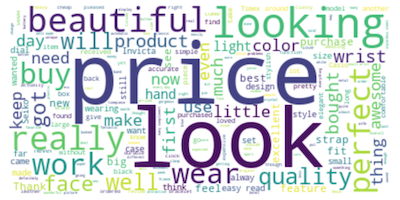

## Classifying Customer Conversations via Natural Language Processing

#### An Analysis by Muoyo Okome

## Goals

If you own or manage a business with any level of success, your customers are frequently having conversations about you and the products you sell, but what are these customers saying? Now what if you had access to automated tools that could monitor these conversations, gage the sentiment of your customers, and then initiate appropriate action as necessary.

This analysis seeks to take a step towards making that reality. The key question we look to answer is whether knowing the text of an Amazon Customer Review can help us predict whether the review is positive (4 or 5 stars) or negative (1 or 2 stars), ignoring the more neutral and less actionable 3-star reviews in the middle.

We then use the best of our predictive models to power a web app that can be deployed to predict the sentiment of not just an Amazon review, but any text from a customer that relates to a particular product.

## Contributors:
 - Muoyo Okome ([@muoyo](https://github.com/muoyo/))

## Summary & Links to Files:
- [Slide Deck (PDF)](presentation/amazon-nlp.pdf)
- [Data Source:](https://registry.opendata.aws/amazon-reviews/) [Amazon Customer Reviews Dataset](https://registry.opendata.aws/amazon-reviews/)
- [Notebooks](notebooks/)
    - [Technical Notebook](notebooks/amazon.ipynb)
    - [Exploratory Data Analysis](notebooks/amazon_eda.ipynb)
- [Python Files](python_files/)
    - [Language Processing](python_files/nlp.py)
    - [Data Cleaning](python_files/data_cleaning.py)
    - [Classification](python_files/classification.py)
    - [Visualizations](python_files/visualizations.py)
